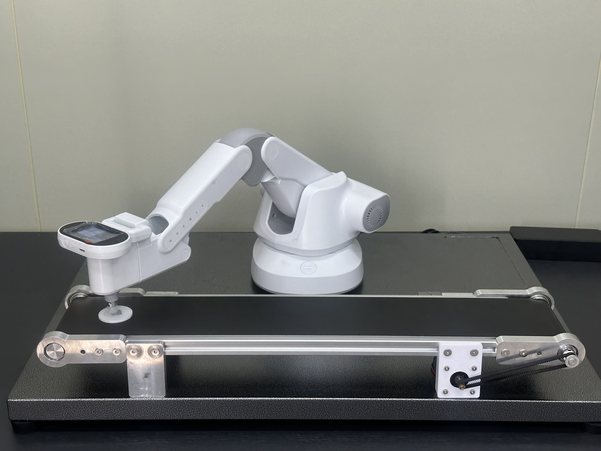
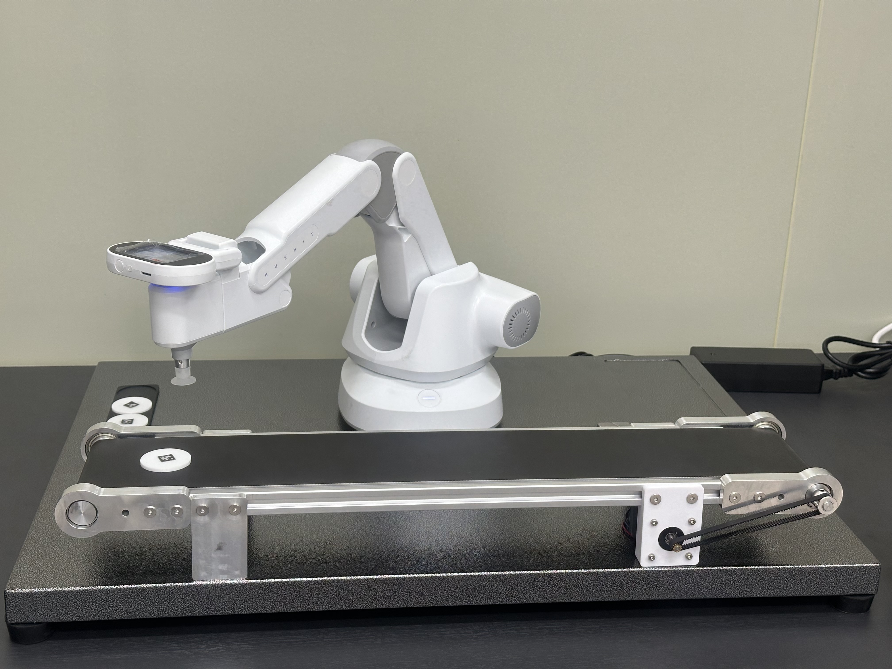

# 변수 상세 가이드

#### 블록 다이어그램

<figure><figcaption></figcaption></figure>

***

## 1. 홈 좌표

아래의 사진처럼 전체 동작을 실행하기 전의 홈 좌표를 설정합니다.

<figure><figcaption></figcaption></figure>

## 2. 집기 좌표

컨베이어로 옮길 각 물체의 좌표를 설정합니다.


x,y,z,좌표 리스트에서 각 위치에 대한 순서를 동일하게 해야합니다.


<figure><figcaption></figcaption></figure>

## 3. 물체 높이

컨베이어 위에서 집을 물체의 z좌표를 설정합니다.


* 로봇 팔에 석션 모듈을 장착시킨 후, 컨베이어에 물체를 올리고 그 위에 로봇팔을 올려 z값을 측정합니다.
* 좌표값이 너무 낮으면 동작중 석션 모듈이 분리될 수 있습니다.
* 좌표값이 너무 높으면 동작중 물체를 제대로 집지 못할 수 있습니다.


<figure><figcaption></figcaption></figure>

## 4. 컨베이어 놓/대기

물체를 놓을 컨베이어 위의 좌표 및 컨베이어가 움직이는 동안 로봇 팔이 대기하고 있을 위치의 좌표를 설정합니다.

<figure><figcaption>
[컨베이어 놓기] 위치
</figcaption></figure> <figure><figcaption>
[컨베이어 대기] 위치
</figcaption></figure>

## 5. 분류 좌표

인식시킨 각 물체를 분류할 위치의 좌표를 설정합니다.


x,y,z,좌표 리스트에서 각 위치에 대한 순서를 동일하게 해야합니다.


## 6. 기본 z좌표

기본 z좌표를 설정합니다.


기본 z좌표는 물체를 집기 직전, 물체 분류 후 홈으로 돌아가기 직전 등과 같이 주변 장애물에 부딪히지 않게 하기 위한 좌표 이므로, 코드를 실행해 가며 그 위치에 대한 좌표를 적절하게 설정하는 것이 중요합니다.

