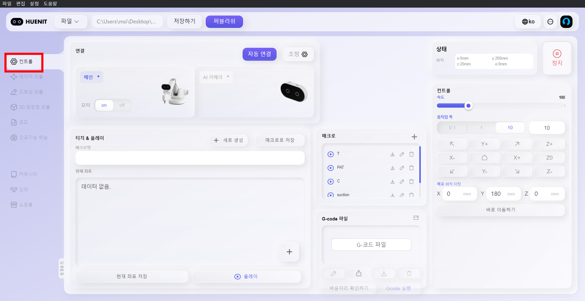

# 로봇의 좌표 측정 방법

## 1. AI 카메라를 통한 측정


AI 카메라로 로봇의 좌표를 측정하기 위해 로봇과 AI 카메라를 연결시켜야 합니다.


#### (1) \[로봇 조작] 메뉴 진입

<figure><figcaption></figcaption></figure>

#### (2) \[티치&플레이] 진입&#x20;

<figure><figcaption></figcaption></figure>

#### (3) \[추가] 버튼 클릭

<figure><figcaption></figcaption></figure>

#### (4) 좌표 측정

**Step 1** : 로봇 팔 가운데의 버튼을 눌러 로봇 팔의 모터를 끕니다.(로봇 팔이 자유롭게 이동 가능한 상태가 됩니다.)

**Step** **2** : 원하는 위치로 로봇 팔을 이동시킨 후, 다시 가운데 버튼을 눌러 모터를 켭니다.(로봇 팔이 고정됩니다.)

**Step 3** : AI 카메라의 화면에 나오는 좌표를 확인합니다.

***

## 2. PC를 통한 측정


PC 로봇의 좌표를 측정하기 위해 로봇과 PC를 연결시켜야 합니다.


#### (1) HUENIT \[컨트롤] 탭 진입

<figure><figcaption></figcaption></figure>

#### (2) \[자동 연결] 버튼 클릭

<figure><figcaption></figcaption></figure>

#### (3) 좌표 측정

**Step 1** : 로봇 팔 가운데의 버튼을 눌러 로봇 팔의 모터를 끕니다.(로봇 팔이 자유롭게 이동 가능한 상태가 됩니다.)

**Step** **2** : 원하는 위치로 로봇 팔을 이동시킨 후, 다시 가운데 버튼을 눌러 모터를 켭니다.(로봇 팔이 고정됩니다.)

**Step 3** : HUENIT LAB의 \[상태] 화면에서 좌표를 확인합니다.

<figure><figcaption></figcaption></figure>
